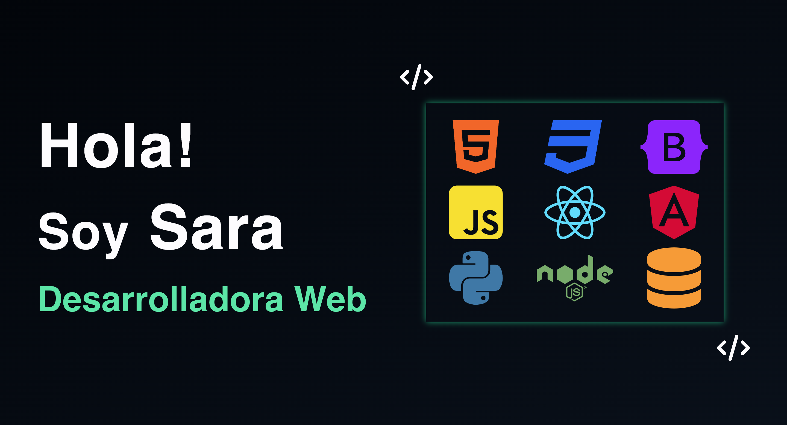

# Portfolio Project

Welcome to my Portfolio Project repository! This project showcases my skills and achievements as a full stack developer. It serves as a comprehensive overview of my journey, featuring a collection of projects, experiences, and technologies I've worked with.

<p align="center">Explore my portfolio live <a href="https://main.d2wseou7aj28mk.amplifyapp.com/#about" target="_blank">here</a></p>



## Features

- 📂 Project Showcase: View a curated selection of projects, each highlighting different skills and technologies.
- 📄 Resume: Download my detailed resume to learn more about my education, skills, and work experience.
- 📧 Contact Form: Connect with me using the integrated contact form for inquiries or collaboration opportunities.

## Technologies Used
This project is built using the following technologies and tools:
- React
- JavaScript
- Node.js
- Express
- Bootstrap
- AWS
- GitHub Actions

## Installation

1. Clone the repository:
   ```bash
   git clone https://github.com/SaraMoreiraG/Portfolio.git

2. Navigate to the project directory:
	```bash
	cd Portfolio

3. Start the development server:
	```bash
	npm run start

4. Open your browser and go to http://localhost:3000/ to view the website.

## Contributing
We welcome contributions! If you'd like to contribute to the project, please follow these steps:

1. Fork the repository.
2. Create a new branch for your feature or bug fix.
3. Make your changes and commit them.
4. Push your changes to your forked repository.
5. Submit a pull request to the main repository.

### License
This project is licensed under the MIT License.

## Contact
If you have any questions or feedback, feel free to contact me at saramordev@gmail.com.

Thank you for exploring my portfolio project! 🚀✨
